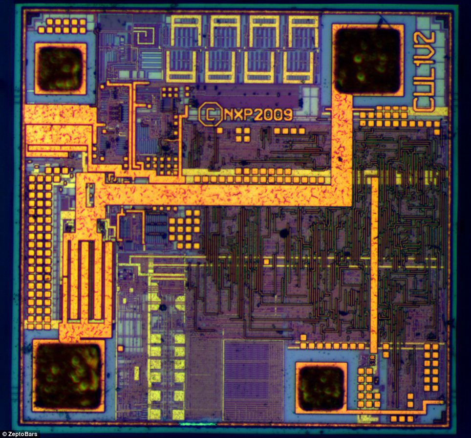

## About Me
Hi, I'm Ananya

I am a final-year **Electronics and Communication Engineering** student at **MIT, Manipal**. 

My academic and research interests lie at the intersection of analog / mixed-signal circuit design, semiconductor device physics and hardware-oriented AI.
I am currently working on the design of a curvature-compensated bandgap reference circuit. I am also developing machine learning frameworks to model and predict subthreshold leakage currents in short-channel CMOS devices.

Reach out to me at:
- **Email:** parasharananya.2@gmail.com
- **LinkedIn:** [Ananya Parashar](https://www.linkedin.com/in/ananya-parashar-049406282/)
